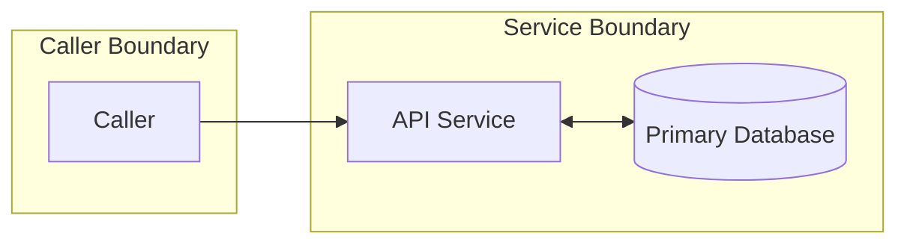
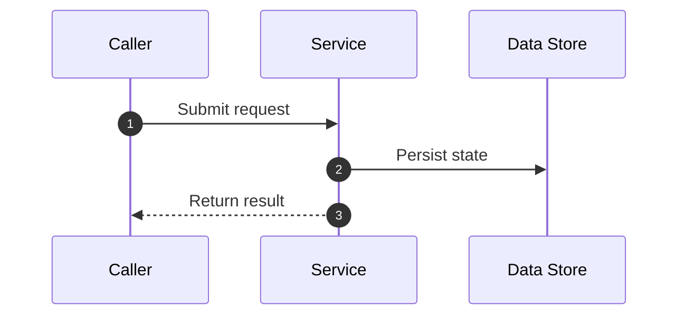
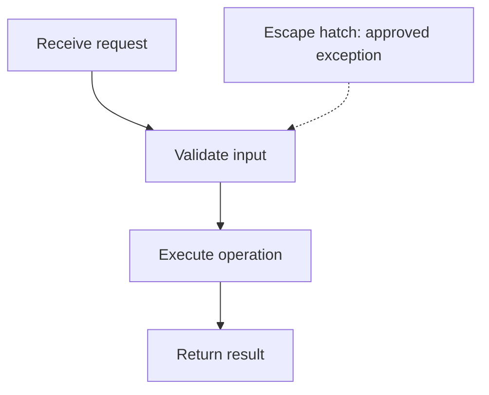
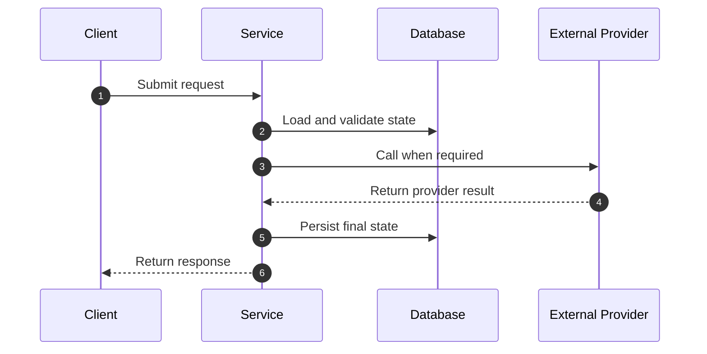
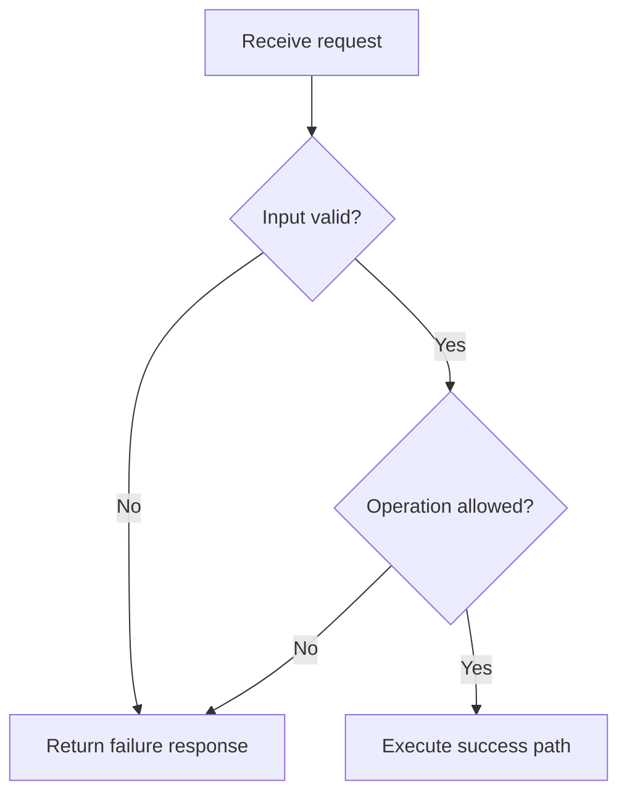
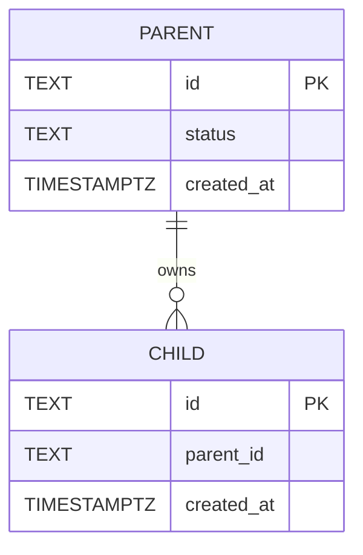
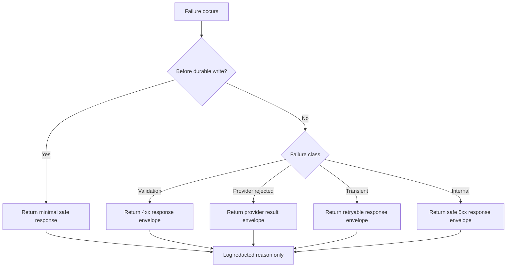

# NNNN. <Diagram Title In Title Case>

- **ADR reference**: [NNNN. <ADR title>](../adr/NNNN-<slug>.md)
- **Related diagram**: [NNNN. <related diagram title>](NNNN-<slug>.md)
- **Purpose**: one line listing the views this document provides (system context, sequences, flowcharts, data model, failure handling, …).

One or two sentences of scope. State who/what this diagram is for and, if relevant, what it is explicitly *not* for (point readers to the correct diagram instead). Keep it factual.

> Keep diagrams in sync with the owning ADR. If the ADR and this diagram disagree, update both in the same change (see [0000. ADR Authoring Standard](../adr/0000-adr-authoring-standard-kiss.md)).

## System Context

High-level boxes and the edges between them. Show ownership boundaries (services, databases, external providers), not internal logic.

## <Primary Flow / Provisioning / Setup>

The main happy-path sequence. Use `autonumber`. Keep participant names short and consistent across every sequence in the file.

Rules:

- List the invariants this flow must preserve as short bullets.
- State anything that happens exactly once, or only under a grace window.

## KISS Default Path

The simplest path a normal caller follows. Mark exceptions as explicit escape hatches.

KISS defaults:

- State the boring default (one version, one middleware, one SDK surface, etc.).
- List what is an exception rather than the normal path.

## <Request / Response / Detailed> Sequence

## Verification / Decision Flowchart

Use a top-down flowchart for branching validation logic. Funnel every rejection branch to a single, clearly named failure node.

## Data Model Extension

Only the entities this decision adds or changes. No cross-database foreign keys if services own separate databases — say so explicitly.

Notes:

- Call out which fields live in Redis vs Postgres vs logs.
- Name the source of truth and any convenience projections.

## Failure Handling

## Implementation Checklist

1. <First safe, incremental step.>
2. <Schema / migration change, if any.>
3. <Service wiring (middleware, handlers, events).>
4. <SDK / client surface changes.>
5. <Tests: unit, integration, contract, migration.>
6. <Observability: logs, metrics, redaction rules.>
7. <Operations: rotation, rollback, replay, backfill.>
