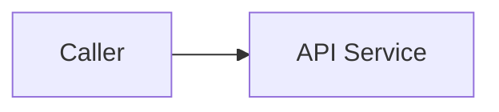

# Design: <Feature Name>

- **Jira feature**: `<PROJECT-0000>`
- **Requirements**: [requirements.md](requirements.md)
- **API contract**: [api-contract.md](api-contract.md) — Required / Not required
- **Requirements revision**: <integer, starting at 1>
- **Contract revision**: <integer or `Not required`>
- **Requirements status**: Draft
- **Contract status**: Draft / Not required
- **Status**: Draft
- **Design revision**: <integer, starting at 1>

Do not design against unapproved requirements or an applicable unapproved API contract.

## Architecture References

- **ADR index**: [docs/adr](../../adr/README.md)
- **Diagram index**: [docs/diagram](../../diagram/README.md)
- **ADRs**: <feature-relevant links or `—`>
- **Feature-local diagrams**: <section links below or `Not required — <reason>`>
- **Durable diagrams**: <feature-relevant links or `—`>

## Architecture Decision Scan

| Topic | Existing authority | Decision location | Action |
|---|---|---|---|
| Public contract | <contract/ADR/none> | requirements or ADR | reuse/create/none |
| Persistence and ownership | <ADR/convention/none> | ADR or design | reuse/create/local |
| State and lifecycle | <spec/diagram/none> | requirements/diagram | reuse/create/none |
| Concurrency/idempotency | <ADR/convention/none> | ADR or design | reuse/create/local |
| Dependency direction | <ADR/convention/none> | ADR | reuse/create/none |

Routing rules:

- Reuse an existing Accepted ADR or current diagram when it governs the feature.
- Create a Proposed ADR for a new cross-cutting, contractual, or hard-to-reverse decision.
- Create or update a durable diagram for an added or changed state model, boundary, topology,
  data model, or cross-component flow that is reusable outside this feature.
- Keep triggered feature-local diagrams and reversible implementation views in this file.
- Required ADRs may be Proposed while drafting design, but must be Accepted before design approval.

## Visual Architecture Check

| Trigger | Present? | Required view |
|---|---:|---|
| Domain/service boundary | Yes/No | boundary/context |
| Actor or external-system interaction | Yes/No | context/sequence |
| Multi-component request/event flow | Yes/No | sequence/flowchart |
| Lifecycle or state transition | Yes/No | state/flowchart |
| Entity relationship | Yes/No | ERD |
| Concurrency, retry, or failure flow | Yes/No | sequence/flowchart |
| Dependency direction or runtime topology | Yes/No | boundary/topology |

If any trigger is `Yes`, include the smallest useful Mermaid view below. A useful diagram has at
least two meaningful components, states, or entities and one relationship, transition, or message.
If every trigger is `No`, state why the acceptance criteria are already sufficient. Promote a
reusable view to `docs/diagram/` instead of maintaining a duplicate here.

## Feature-Local Views

Delete this section only when the Visual Architecture Check records no trigger.

## Repository Alignment

Describe how the feature follows the existing composition root, domain anatomy, response
envelope, context propagation, registration, migration, and transport conventions. Link the
reference domain instead of restating its implementation.

## Proposed Design

### Domain Model

- **<Entity/value>** — <responsibility and invariants>.

### Application Operations

| Contract operation | Internal operation | Input | Result | Requirements |
|---|---|---|---|---|
| `API-...` | <service/use case> | <input> | <result> | `REQ-...` |

### Persistence

- <transaction boundary, constraint, query, migration, or `No change`>

### Contract Implementation Map

| Contract operation | Handler/endpoint | Application operation | Middleware/auth | Verification |
|---|---|---|---|---|
| `API-...` | <handler/procedure or `Not applicable`> | <service operation> | <middleware/guard> | <test/probe> |

The exact request/response shape, status mapping, and stable codes live in `api-contract.md`.
Do not duplicate them here.

### Failure Handling

| Failure | Application error | Client-visible result |
|---|---|---|
| <failure> | <AppError constructor> | <stable result code> |

### Concurrency and Idempotency

- <locking, uniqueness, retry, idempotency, or `Not applicable`>

### Security and Authorization

- <server-side enforcement and data exposure rules>

### Observability

- <audit event, structured log, metric, redaction, or `No change`>

## Requirement Traceability

| Requirement | Contract operation | Design component | Verification level |
|---|---|---|---|
| `REQ-...` | `API-...` or `Not applicable` | <component> | unit/integration/runtime |

Every requirement must appear exactly once in this table. Stop when the design cannot satisfy an
approved requirement without changing its behavior; update requirements first.

## Acceptance Verification Map

| Acceptance criterion | Verification method | Planned evidence |
|---|---|---|
| `AC-...` | unit/integration/runtime/manual | <named test, probe, or review> |

Every acceptance criterion must have an objective verification method before tasks are drafted.

## Verification Strategy

- **Unit**: <business rules and pure logic>
- **Integration**: <database, transaction, transport, or external boundary>
- **Runtime**: <safe API smoke evidence>

## Risks and Tradeoffs

- <feature-local cost or residual risk>

Durable tradeoffs belong in an ADR and are linked above.

## Blocking Design Questions

| ID | Question | Controls | Requested reference/example | Owner | Status | Resolution |
|---|---|---|---|---|---|---|
| `DQ-001` | <technical decision required> | <contract/storage/security/etc.> | <existing implementation, ADR, contract, preferred direction> | <person/role> | Open | — |

Use `None` only when design can be implemented without inventing a material decision. The agent
must ask every Open question and wait before design approval or task drafting.

## Approval

- [ ] Requirements are Approved and identified by revision.
- [ ] Architecture Decision Scan is complete.
- [ ] Visual Architecture Check is complete.
- [ ] Required ADRs are Accepted.
- [ ] Applicable API contract is Approved and revision-pinned above, or marked `Not required`.
- [ ] Every triggered visual concern has a meaningful feature-local or durable diagram.
- [ ] Required durable diagrams exist and do not contradict requirements or ADRs.
- [ ] Every requirement maps to one design component.
- [ ] Every acceptance criterion has a verification method.
- [ ] Public contracts, migrations, failures, security, and concurrency are addressed.
- [ ] Blocking Design Questions is `None`.
- [ ] No new observable behavior exists only in design.
- **Approved by**: —
- **Approved at**: —
