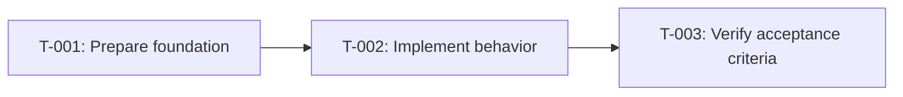

# Tasks: <Feature Name>

- **Jira feature**: `<PROJECT-0000>`
- **Requirements**: [requirements.md](requirements.md)
- **API contract**: [api-contract.md](api-contract.md) — Required / Not required
- **Design**: [design.md](design.md)
- **Requirements revision**: <integer>
- **Contract revision**: <integer or `Not required`>
- **Design revision**: <integer>
- **Requirements status**: Draft
- **Contract status**: Draft / Not required
- **Design status**: Draft
- **Status**: Draft

Do not create an executable task plan before requirements, the applicable API contract, and design
are approved.

## Execution Rules

- Implement only the requirement and acceptance IDs assigned to the task.
- Stop when requirements, design, ADRs, diagrams, or existing contracts contradict.
- Implement only the contract operations assigned to the task; update the contract before code when
  a client-visible behavior changes.
- Do not resolve an open product or architecture question only in code.
- One acceptance criterion has exactly one primary evidence owner.
- Supporting tasks may implement part of the same acceptance criterion but must name its evidence
  owner; the owner is responsible for final verification, not exclusive implementation.
- Required verification is never optional. Reduce scope through requirements approval, not by
  marking required tests or evidence optional in this file.
- Mark a task complete only after recording actual verification evidence.

## Coverage

| Acceptance criterion | Contract operation | Evidence owner | Jira task | Verification | Evidence |
|---|---|---|---|---|---|
| `AC-...` | `API-...` or `Not applicable` | `T-001` | `<PROJECT-0001>` or `Unassigned` | <named test/probe> | Pending |

Every acceptance criterion from `requirements.md` must appear exactly once with an evidence owner.

## Task Graph

## Tasks

- [ ] `T-001` <imperative task title>
  - Jira: `<PROJECT-0001>` or `Unassigned`
  - Depends on: `None`
  - Requirements: `REQ-...`
  - Acceptance criteria: `AC-...`
  - Contract operations: `API-...` or `Not applicable`
  - Scope:
    - <small implementation slice>
  - Verification:
    - `<targeted command or named test>`
  - Completion evidence:
    - Status: Pending
    - Command/test: —
    - Result: —
    - PR/commit: —
    - Deviations: None

- [ ] `T-002` <imperative task title>
  - Jira: `<PROJECT-0002>` or `Unassigned`
  - Depends on: `T-001`
  - Requirements: `REQ-...`
  - Acceptance criteria: `AC-...`
  - Contract operations: `API-...` or `Not applicable`
  - Scope:
    - <small implementation slice>
  - Verification:
    - `<targeted command or named test>`
  - Completion evidence:
    - Status: Pending
    - Command/test: —
    - Result: —
    - PR/commit: —
    - Deviations: None

## Final Verification

- [ ] Every acceptance criterion has passing evidence.
- [ ] No externally observable behavior lacks a requirement ID.
- [ ] No out-of-scope behavior was implemented.
- [ ] Required ADRs and diagrams match the implementation.
- [ ] Generated Swagger/OpenAPI or runtime contract evidence matches the approved contract when applicable.
- [ ] Applicable tests, build, lint, generated-file, migration, and runtime checks pass.
- [ ] Deviations are resolved in requirements/design, not documented only here.

## Approval

- [ ] Requirements and design are Approved and revision-pinned above.
- [ ] Applicable API contract is Approved and revision-pinned above, or marked `Not required`.
- [ ] Every acceptance criterion has exactly one evidence owner.
- [ ] Every task has bounded scope, dependencies, Jira mapping, and verification.
- [ ] Task graph includes all required work and ends at Final Verification.
- [ ] No task introduces behavior or architectural rationale absent from predecessor artifacts.
- **Approved by**: —
- **Approved at**: —
